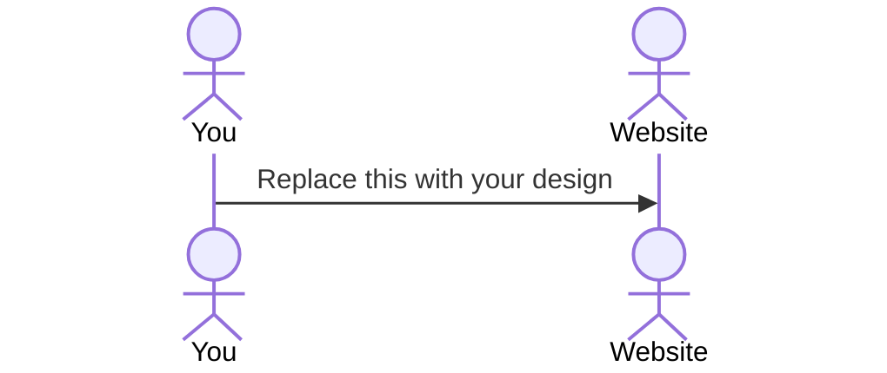

# Roller Skate Racing

[My Notes](notes.md)

Rollerskate racing is a fun app used to design a rollerskate, view past rollerskates that have been created, and then race your rollerskate against other players. It's a fun app that allows creativity as welll as competition.

## 🚀 Specification Deliverable

> [!NOTE]
>  Fill in this sections as the submission artifact for this deliverable. You can refer to this [example](https://github.com/webprogramming260/startup-example/blob/main/README.md) for inspiration.

For this deliverable I did the following. I checked the box `[x]` and added a description for things I completed.

- [x] Proper use of Markdown
- [x] A concise and compelling elevator pitch
- [x] Description of key features
- [x] Description of how you will use each technology
- [x] One or more rough sketches of your application. Images must be embedded in this file using Markdown image references.

### Elevator pitch

Rollerskate racing is a fun game that allows both creativity and competition. It's all about designing the coolest rollerskates and then using that rollerskate to race against other players. When designing each skate, you can choose the color, type of design, and the color of the laces as well. Then... you RACE. Fastest skate wins!

### Design

This is a basic mockup for the rollerskate racing game. You can see that there are three sections for the game. Because this is my first time working with developing a website I'm going to be keeping the UI pretty simple, but still visually interersting for the user.

Down below I will be making in the sequence diagram. I just still need to learn how that works.

### Key features

- Secure Login
- Ability to design a skate and save it to your profile
- View the skates that were previously made
- Race your skates against others
- View the leaderboard for the fastest times

### Technologies

I am going to use the required technologies in the following ways.

- **HTML** - HTML Pages for login, landing page, skate design, skate library, and skate racing. 
- **CSS** - Make it adaptable to all of the different screens
- **React** - I will use react to allow the user to move between screens
- **Service** - I will use API's to allow the user to publish scores to a global leaderboard, and maybe one day you can even add friends and see their skates
- **DB/Login** - The user needs an account to see their totally wicked skates! They should login before starting
- **WebSocket** - This is what will be used to allow the user to see the other skate times

## 🚀 AWS deliverable

For this deliverable I did the following. I checked the box `[x]` and added a description for things I completed.

- [x] **Server deployed and accessible with custom domain name** - [My server link](https://chaseashton.click.

## 🚀 HTML deliverable

For this deliverable I did the following. I checked the box `[x]` and added a description for things I completed.

- [x] **HTML pages** - I made 5 HTML pages. The login page, the landing page, and then a page for each of the actions that the user should be able to do. Now there is a place to view their skates, design skates, and race their skates. 
- [x] **Proper HTML element usage** - I included most of my code inside the body element of my HTML, and then used paragraph, header, div, link, and image elements for the contents
- [x] **Links** - Links were added between the pages to allow for ease of navigation.
- [x] **Text** - Text is used to add descriptions to each of the pages, as well as convey important information about the skates themselves.
- [x] **3rd party API placeholder** - I added a leaderboard where the user is able to see the top skates a times
- [x] **Images** - I made my own image assets using a design I found on the internet. I used an image of a rollerskate I found and then customized it in Adobe Illustrator and then I made them SVD's to allow for ease of rescalability.
- [x] **Login placeholder** - There is a place for the user to sign in, but it is not yet functional.
- [x] **DB data placeholder** - The user then is able to see the skates they have created
- [x] **WebSocket placeholder** - This is also part of the leaderboard, seeing the times of other skates.

## 🚀 CSS deliverable

For this deliverable I did the following. I checked the box `[x]` and added a description for things I completed.

- [x] **Header, footer, and main content body** - I became very familiar with Bootstrap header and footer elements and used their examples to construct visually appealing yet concise headers and footers. The Body element
- [x] **Navigation elements** - I was able to finish working on the screens where the user will be able to design their skates and view their designed skates. You are able to navigate with ease from one thing screen to another and back
- [x] **Responsive to window resizing** - The app is able to resize and rearrange based on the screen size. This was particularly easy because of the grid system that Bootstrap uses
- [ ] **Application elements** - As has been mentioned before I designed all of the different pages using the bootstrap elements. Breaking each thing down into it's rows and columns allows for a very organized and orderly layout.
- [x] **Application text content** - Using CSS I was able to import fonts from google and use those fonts to add style to each page.
- [x] **Application images** - All of the images used in this project are svg's to allow for ease of resizability and to take up less storage. Effects were applied to present the images in an organized manner.

## 🚀 React part 1: Routing deliverable

For this deliverable I did the following. I checked the box `[x]` and added a description for things I completed.

- [x] **Bundled using Vite** - I installed vite and used it to bundle my react code
- [x] **Components** - I changed my components to now be react file
- [x] **Router** - Added routing between the different pages using NavLinks, and Navigate

## 🚀 React part 2: Reactivity

For this deliverable I did the following. I checked the box `[x]` and added a description for things I completed.

- [x] **All functionality implemented or mocked out** - The Skate Clicker Game is now fully functional! You can design a skate, add it to your library, and equip it to then use it in the game.
- [x] **Hooks** - There are react variables used throughout the app specifically the user data.

## 🚀 Service deliverable

For this deliverable I did the following. I checked the box `[x]` and added a description for things I completed.

- [x] **Node.js/Express HTTP service** - I created the service folder that 
- [x] **Static middleware for frontend** - There is middleware to verify that the user is logged in before using an endpoint
- [x] **Calls to third party endpoints** - Included a button to get Chuck Norris Jokes :)
- [x] **Backend service endpoints** - I created several backend endpoints to get and modify the data such as clicks, skates, equipped skates, and leaderboard
- [x] **Frontend calls service endpoints** - The front end calls those endpoints

## 🚀 DB/Login deliverable

For this deliverable I did the following. I checked the box `[x]` and added a description for things I completed.

- [ ] **User registration** - I did not complete this part of the deliverable.
- [ ] **User login and logout** - I did not complete this part of the deliverable.
- [ ] **Stores data in MongoDB** - I did not complete this part of the deliverable.
- [ ] **Stores credentials in MongoDB** - I did not complete this part of the deliverable.
- [ ] **Restricts functionality based on authentication** - I did not complete this part of the deliverable.

## 🚀 WebSocket deliverable

For this deliverable I did the following. I checked the box `[x]` and added a description for things I completed.

- [ ] **Backend listens for WebSocket connection** - I did not complete this part of the deliverable.
- [ ] **Frontend makes WebSocket connection** - I did not complete this part of the deliverable.
- [ ] **Data sent over WebSocket connection** - I did not complete this part of the deliverable.
- [ ] **WebSocket data displayed** - I did not complete this part of the deliverable.
- [ ] **Application is fully functional** - I did not complete this part of the deliverable.
